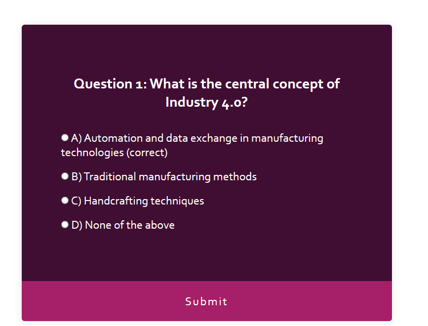

# Industry 4.0 - Quiz

## Overview
This is a simple quiz application built using HTML, CSS, and JavaScript. It allows users to answer a single-choice question and submit their answer.

## Usage
1. Clone or download the repository to your local machine.
2. Open the `index.html` file in a web browser.
3. Read the question and select one of the provided answers.
4. Click the "Submit" button to submit your answer.
5. View your result.

## Files
- `index.html`: Contains the HTML structure of the quiz app.
- `styles.css`: Contains the CSS styles for styling the quiz app.
- `script.js`: Contains the JavaScript code for the quiz app functionality.

## Contributing
Contributions are welcome! If you find any bugs or have suggestions for improvements, please open an issue or submit a pull request.

## License
This project is licensed under the MIT License. See the LICENSE file for details.
